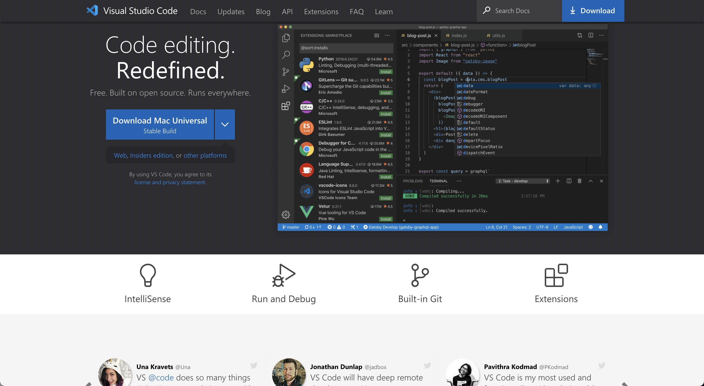
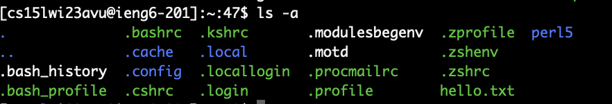
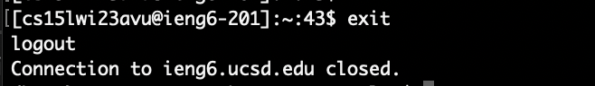

# Week 1 Lab Report
In this lab report, I will be walking through the steps to set up the CSE 15L lab environment.

&nbsp;

## **Step 1: Installing VS Code**
___
To install VS Code, first go on their website https://code.visualstudio.com/. Then, follow the instructions needed to download on your computer. Make sure to pick the correct operating system for your installment.

*(Step 1)*

## **Step 2: Remotely Connecting**
___
To remotely connect, first open the terminal. Then, copy this command "ssh cs15lwi23avu@ieng6.ucsd.edu" to ssh into the CSE Basement server. Lastly, the terminal will prompt you for your password. Enter your password and you will have access to the server.

*(Step 2)*

## **Step 3: Trying Some Commands**
___
Lastly, to test that your connection is working, you can try some commands. Some commands include:

* cd ~
* cd
* ls -lat
* ls -a
* ls <directory>
* cp /home/linux/ieng6/cs15lwi23/public/hello.txt ~/
* cat /home/linux/ieng6/cs15lwi23/public/hello.txt

... and more!

*(Step 3)*

&nbsp;
> (TIP!) Make sure to log out of the remote server using Ctrl-D or by running the command "exit".

	
*(Tip)*

&nbsp;

And you're done! Thanks for reading. :)