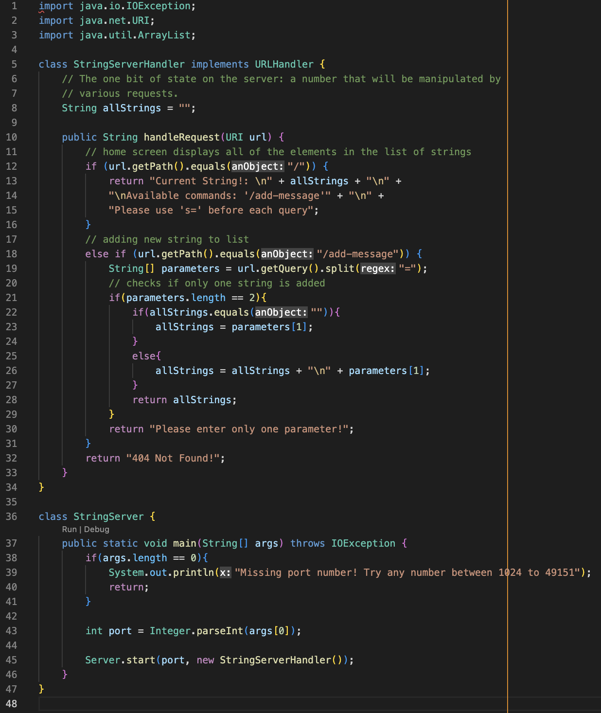
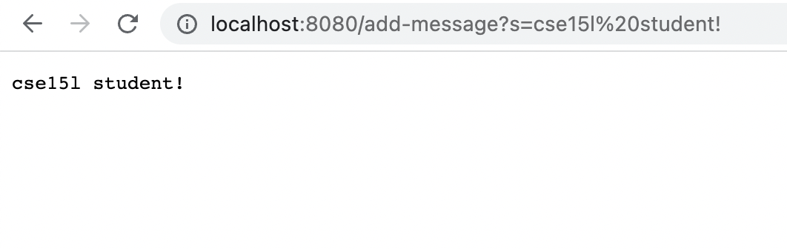
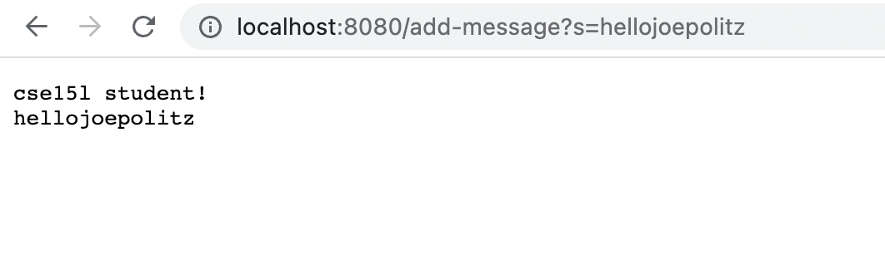
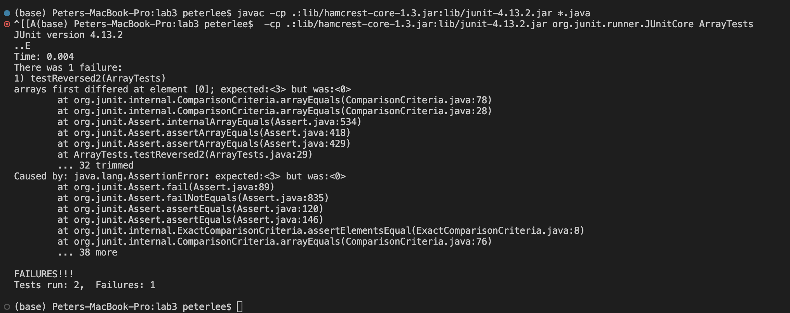

# Week 3 Lab Report
In this week's lab report, students are required to analyze servers and bugs.

&nbsp;
## **Part 1**
___

For Part 1 of the assignment, students are required to create a web server called StringServer that keeps track of a single string that gets added to by incoming requests.

**Here is the code for my StringServer:**



**And two screenshots of using /add-message:**

1. **Screenshot #1**


> *Which methods in your code are called?*

* The handleRequest method is called from the StringServerHandler class. The handleRequest method can take the path "/add-message". This is demonstrated in the screenshot. There is a query along with the path with the string "cse 15l student!".

> *What are the relevant arguments to those methods, and the values of any relevant fields of the class?*

* The relevant arguments to the handleRequest method is a URI object. This is the url in the screenshot, including the path and query. The StringServerHandler class has one instance variable named "allStrings" that holds all of the strings added through the website query.

> *How do the values of any relevant fields of the class change from this specific request? If no values got changed, explain why.*

* The "allStrings" variable changes from this specific request. Everytime the "/add-message" path is called, the string queried with the path is added to the "allString" variable, along with a "\n" to add a new line. The new line separates the queried strings from each other. Here, no string was previously in "allString", so when we add "cse 15l student!" in the query, it is the only string displayed on the screen

2. **Screenshot #2**


> *Which methods in your code are called?*

* The handleRequest method is called again from the StringServerHandler class. The handleRequest method takes the path "/add-message", as demonstrated in the screenshot. The path also has the query "hellojoepolitz".


> *What are the relevant arguments to those methods, and the values of any relevant fields of the class?*

* The relevant arguments to the handleRequest method is a URI object. This is the url in the screenshot, including the path and query. The StringServerHandler class has one instance variable named "allStrings" that holds all of the strings added through the website query.


> *How do the values of any relevant fields of the class change from this specific request? If no values got changed, explain why.*

* The "allStrings" variable changes from this specific request. Everytime the "/add-message" path is called, the string queried with the path is added to the "allString" variable, along with a "\n" to add a new line. The new line separates the queried strings from each other. Here, there is a previous string in "allString", so we add a new line and the queried string "hellojoepolitz" to update the variable. Now, the screen displays "cse 15l student!" and on a new line "hellojoepolitz".

## **Part 2**
___
For Part 2 of the assignment, students are required to analyze one of the bugs from lab 3.

> A failure-inducing input for the buggy program, as a JUnit test and any associated code (write it as a code block in Markdown)

```java
  @Test
  public void testReversed2() {
    int[] input1 = {1, 2, 3};
    assertArrayEquals(new int[]{3, 2, 1}, ArrayExamples.reversed(input1));
  }
```

> An input that doesn’t induce a failure, as a JUnit test and any associated code (write it as a code block in Markdown)

```java
  @Test
  public void testReversed1() {
    int[] input1 = {0, 0, 0};
    assertArrayEquals(new int[]{0, 0, 0}, ArrayExamples.reversed(input1));
  }
```

> The symptom, as the output of running the tests (provide it as a screenshot of running JUnit with at least the two inputs above)



> The bug, as the before-and-after code change required to fix it (as two code blocks in Markdown)

**Before:**
```java
  static int[] reversed(int[] arr) {
    int[] newArray = new int[arr.length];
    for(int i = 0; i < arr.length; i += 1) {
      arr[i] = newArray[arr.length - i - 1];
    }
    return arr;
  }
```

**After:**
```java
  static int[] reversed(int[] arr) {
    int[] newArray = new int[arr.length];
    for(int i = 0; i < arr.length; i += 1) {
      newArray[i] = arr[arr.length - i - 1];
    }
    return newArray;
  }
```

Explanation:
The failure inducing input is {1, 2, 3}. The symptom is that the test expects [3] at index 0, but recieves [0]. Because 0 is not a part of the initial input, there must be a bug in the code that sets the values of arr to 0.

After inspection, the bug seems to be that we are assigning values of arr to the reveresd values of newArray, a new array that we created but have not yet initialized. As all of the values in a non-initialized int array are 0, it makes sense why the values of our arr array is 0 upon returning.

To fix the bug, we must assign reversed arr values into newArray instead of assigning reversed newArray values into arr.

* Old:
```java
arr[i] = newArray[arr.length - i - 1];
```
* New:
```java
newArray[i] = arr[arr.length - i - 1];
```

Now, we have loaded the values of arr in newArray in reverse order.
As our updated array is held in newArray, return newArray instead of arr to complete the bugfix.

## **Part 3**
___
> In a couple of sentences, describe something you learned from lab in week 2 or 3 that you didn’t know before.

From the past two labs, I have learned a lot about servers and bugfixing.

In week 2, I learned how to take in requests from a URI and how to process these requests based on their path and query. I learned how to identify the path and query in a link, and how to create methods that use these inputs to display information on the website.

In week 3, I learned the importance of testing code to identify bugs. I learned the difference between symptoms and bugs. A symptom is the issue that you see from the output, whereas the bug is the actual code that is causing the error on the screen. I learned how to manipulate JUnit tests in order to test my code for bugs, as well as how to read buggy code to identify a symptom-causing error.
