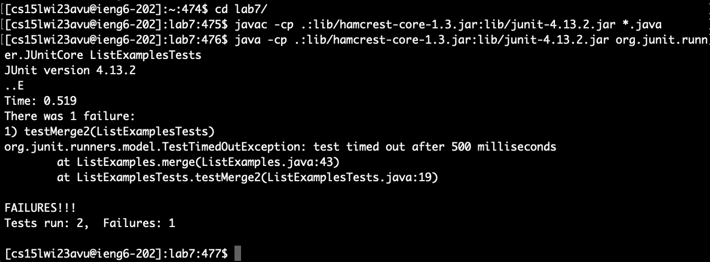

# Week 7 Lab Report
In this week's lab report, students are required to reproduce the tasks from Week 7's lab. These tasks excersize the student's ability to pull, push, commit, and edit files using terminal and Git.

Students must complete **Steps 4 - 9** and walk through every step on the lab report.

&nbsp;
## **Step 4: Log into ieng6**
___
___Keys pressed:___
- <Command + V>
- \<enter>

The ```ssh cs15lwi23avu@ieng6.ucsd.edu``` command was already saved in a notepad. I copied this command in notepad using ```Command + C```, but because this was not within the scope of the terminal, it is not listed under keys pressed. To log into ieng6, I simply pasted this command into terminal using ```Command + V```. I pressed ```enter``` to run the command. No password was required because I already added the ieng SSH key to my Github account. I am now logged into ieng6.


&nbsp;
## **Step 5: Clone your fork of the repository from your Github account**
___
___Keys pressed:___
- git clone
- <Command + V>
- \<enter>

To clone the fork of the repository, I first type out ```git clone``` in my bash. Then, I copied the repository's SSH link on the Github website repository. To finish the cloning, I pasted this link using ```Command + V```. The following resulted to the command: ```git clone git@github.com:peterchwl/lab7.git```. I pressed ```enter``` to run the command. Now the fork is cloned.


&nbsp;
## **Step 6: Run the tests, demonstrating that they fail**
___
___Keys pressed:___
- cd l
- \<tab>
- \<enter>
- <Command + V>
- \<enter>
- <Command + V>
- \<space>
- L
- \<tab>
- T
- \<tab>
- \<delete>
- \<enter>

To run the tests, I first went into the lab7 directory using ```cd l```, and pressing ```tab``` to complete the rest of the command. I pressed ```enter``` to run the command. I copied the command to compile the test ```javac -cp .:lib/hamcrest-core-1.3.jar:lib/junit-4.13.2.jar *.java``` from the Week 7 lab instructions and used ```Command + V``` to paste it into the bash. I pressed ```enter``` to run the command. I then copied the command to run the test ```java -cp .:lib/hamcrest-core-1.3.jar:lib/junit-4.13.2.jar org.junit.runner.JUnitCore``` from the Week 7 lab instructions and used ```Command + V``` to paste it into the bash. To specify which file was running the tests, I pressed ```space``` to separate the command from the file and then typed ```L```. I pressed ```tab``` to write out ```ListExamples```, then typed ```T``` and pressed ```tab``` to write out ```ListExamplesTests.```. I pressed ```delete``` at the end to get rid of the period at the end of the file. The final command resulted to ```java -cp .:lib/hamcrest-core-1.3.jar:lib/junit-4.13.2.jar org.junit.runner.JUnitCore ListExamplesTests```. I pressed ```enter``` to run the command. The tests demonstrate that they fail.



&nbsp;
## **Step 7: Edit the code file to fix the failing test**
___
___Keys pressed:___
- nano L
- \<tab>
- .java
- \<enter>
- \<right>
- \<right>
- \<right>
- \<right>
- \<right>
- \<right>
- \<right>
- \<right>
- \<right>
- \<right>
- \<right>
- \<right>
- \<delete>
- 2
- \<control + O>
- \<enter>
- \<control + X>

To edit the code file, I nano into the file by typing out ```nano L``` and then pressing ```tab``` to complete the line. I added ```.java``` at the end of the line. The line resulted to ```nano ListExamples.java```. I pressed ```enter``` to run the command. Now in the code file, I scroll all the way down to the line with the error. Then, I press ```right``` twelve times to get to the edit the character with the error. The error is that index1 is being added by 1 when index2 should be added by 1 instead. I press ```delete``` to delete "1" and type in ```2```. To save the file, I use ```control + O```. I pressed ```enter``` to confirm the save. To exit the file, I use ```control + X```. Now, the code file is successfully edited so that the failing test is fixed.


&nbsp;
## **Step 8: Run the tests, demonstrating that they now succeed**
___
___Keys pressed:___
- \<up>
- \<up>
- \<up>
- \<enter>
- \<up>
- \<up>
- \<up>
- \<enter>

The ```javac -cp .:lib/hamcrest-core-1.3.jar:lib/junit-4.13.2.jar *.java``` command was 3 up in the search history, so I pressed ```up``` three times to access it. I pressed ```enter``` to run the command. The java files compiled. The ```java -cp .:lib/hamcrest-core-1.3.jar:lib/junit-4.13.2.jar org.junit.runner.JUnitCore ListExamplesTests``` command was 3 up in the search history, so I pressed ```up``` three times to access it. I pressed ```enter``` to run the command. The tests were successfully run without failures this time.


&nbsp;
## **Step 9: Commit and push the resulting change to your Github account**
___
- git add .
- \<enter>
- git commit -m "fixed error"
- \<enter>
- git push

First, I added all the files I wanted to commit by typing ```git add .```. This command automatically adds all the files in the directory to be committed. I pressed ```enter``` to run the command. Then, I committed these files by typing ```git commit -m "fixed error"```. I added a message that says "fixed error". I pressed ```enter``` to run the command. Lastly, I use ```git push``` to push all commits to my Github account. No password or username was required as I used the SSH link.


